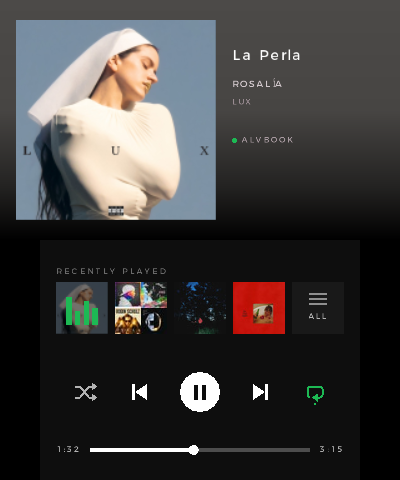
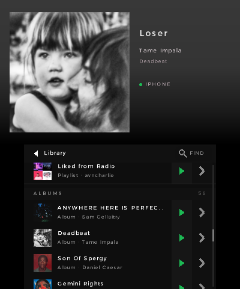
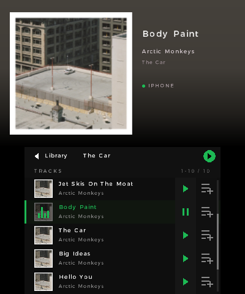
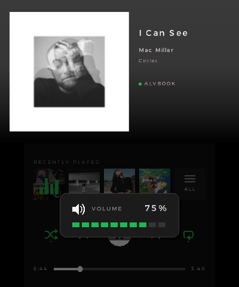
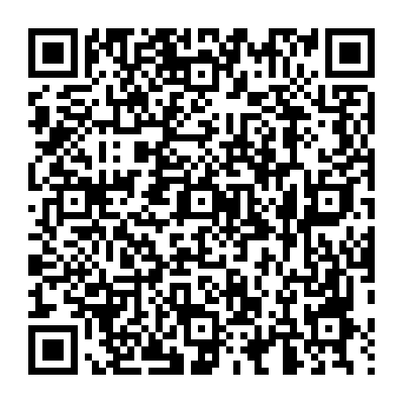

# Spotify3DS

Spotify3DS lets you use your 3DS as a Spotify remote, with playback controls, library browsing, and synchronised lyrics.

https://github.com/user-attachments/assets/caf41073-3456-4d9f-a95f-36ef5e7e0b57
<!--https://github.com/user-attachments/assets/de96f312-1107-42eb-a012-5f5bdfdea7f2-->

- **Top screen:** album cover, artist, album/track name
- **Bottom screen:**
  - **Player** (default view): previous / play-pause / next, plus a seek scrubber
  - **Library:** recently played collections, playlists, saved albums, and their individual tracks. Both your library and any track list can be searched.
  - **Lyrics:** synchronised lyrics (from [LRCLIB](https://lrclib.net/))

You can use the L/R shoulder buttons from any screen to decrease or increase device volume in any screen.

## Screenshots

<p align="center">
  
  
  
  
</p>

## Installation

Scan the QR code below in FBI under **Remote Install → Scan QR Code** to install the latest CIA directly.

<a href="https://github.com/avncharlie/spotify3ds/releases/latest/download/Spotify3DS.cia"></a>

Alternatively, you can manually install `Spotify3DS.cia` or `Spotify3DS.3dsx` from the project's [latest release](https://github.com/avncharlie/spotify3ds/releases/latest).

Now, you'll have to do a one-time setup to link Spotify3DS with your Spotify account. You can do this automatically using the setup app or manually with a Python script that generates a credentials file you copy over to 3DS's SD card.

### Automatic setup (recommended) - use the setup app

1. Download the `Spotify3DS-Setup` app for your computer from the [latest release](https://github.com/avncharlie/spotify3ds/releases/latest).
2. Follow the app's instructions to create a Spotify app and get your client ID. It will then show you a setup QR code.
3. Now open Spotify3DS and choose **Scan Setup QR** and scan this code.
   Spotify3DS will then log you in and you can start using the app.

This process writes a `creds.cfg` file to the `spotify` folder on your SD card. It
holds a token for your account rather than your password, but anyone who has it
can read your library and listening history and control your playback, so keep it
to yourself. You can revoke it at any time from your Spotify account settings
under **Apps**.

### Manual setup - use the `bootstrap_auth.py` script

1. Create an app in the [Spotify Developer Dashboard](https://developer.spotify.com/dashboard).
   Select **Web API**, add `http://127.0.0.1:8888/callback` as a redirect URI,
   and copy the app's Client ID. No client secret is needed.
   
   If you're having difficulty with this, look at [this issue](https://github.com/avncharlie/spotify3ds/issues/3#issuecomment-5298331372) to see some screenshots of the process.
2. Clone or download this repo, and run the following command from this project directory to generate your console credentials:

   ```sh
   python3 tools/bootstrap_auth.py --client-id <YOUR_CLIENT_ID>
   ```

   Your browser will open Spotify's authorization page. After approval, the
   script writes `creds.cfg` in the project directory.
3. Create a folder named `spotify` at the root of the 3DS SD card and copy the
   generated file to it. The resulting path must be `/spotify/creds.cfg`.
4. Spotify3DS should now be set up and connected to your account.

## Controls

- On any screen:
  - `L/R` decrease/increase volume
  - Tap D-pad left/right to skip
  - Hold D-pad left/right to seek forwards or backwards
  - `START` opens lyrics for the current track
  - `B` goes to the previous screen
  - Hold `L` and press `START` to exit

- Player
  - `A` play/pause
  - `X` to go to Library
  - `Y` show/hide cover art
  - Tap `LYRICS` in the header to open lyrics for the current song.
  - Tap a Recently Played tile to open its tracks; long press it to start playing it immediately.
- Library:
  - `A` start the selected collection, then play/pause
  - `X` open its tracks
  - `ZL/ZR` jump between recently played / playlists / albums
  - D-pad up/down to select a collection
  - Tap a row's play icon to start it, or its right chevron to open its tracks.
  - Tap magnifying glass in the header to search for a playlist/album in your library.
  - Press and hold the magnifying glass to view previous searches and search them again
- Tracks:
  - `A` play/pause the selected track
  - `X` queue the selected track
  - `ZL/ZR` see the previous / next page of tracks on big playlists. Go back from the start of playlist to go to its last page of tracks
  - D-pad up/down to select a track
  - Tap a row's play icon to start it, or its right queue icon to queue it.
  - Tap magnifying glass in the header to search the whole album or playlist by track name, artist, or album.
- Lyrics:
  - D-pad/Circle Pad up/down to scroll
  - Drag to scroll; tap `FOLLOW` for synchronised lyrics scrolling.
  - Tap a timestamped line to seek Spotify to it.

Upon searching a track within a playlist, the playlist's tracks are cached so that subsequent searches on that playlist are snappy.
A playlist's track cache is invalidated when the playlist is updated in any way.

## Lyrics provider

Spotify's Web API does not expose lyrics. Spotify3DS sends the current track,
artist, album, and duration to the open, keyless [LRCLIB](https://lrclib.net/)
API. Exact matches are preferred, search results are checked against track
metadata and duration, and synchronised lyrics are used only when their LRC
timestamps parse successfully. No Spotify access token is sent to LRCLIB.

## Development

Build instructions, test tools, release automation, and implementation notes
are documented in [DEVELOPMENT.md](DEVELOPMENT.md).
